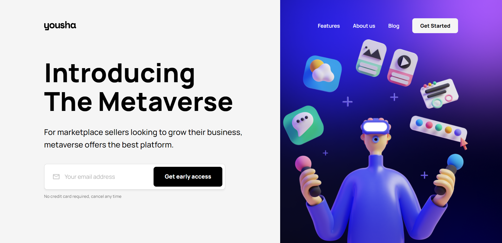
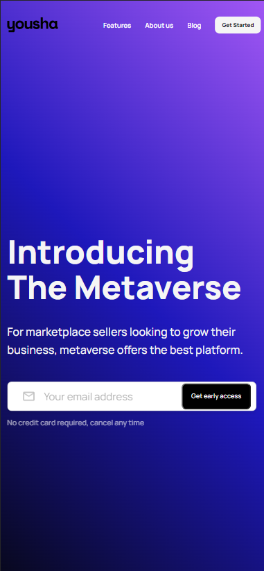

## Landing Page - Yousha

* Esse é uma landing page de um projeto do Figma com o intuito de apresentar o metaverso por meio de uma inscrição do e-mail.
* Link do projeto no Figma: https://www.figma.com/file/HplFdHCpvAexJmVOsNPpRU/Hero-Header-004---VR%2FVirtual-Reality-Startup-(Community)
* Tecnologias utilizadas:

* Como implementação optei por adaptar a landing page para a versão mobile que não tem no projeto original do Figma. Nessa versão é removido a imagem e colocado um background gradiente e algumas cores de fontes são alteradas.

<h3 align="center">-- Mobile Version --<h3>

